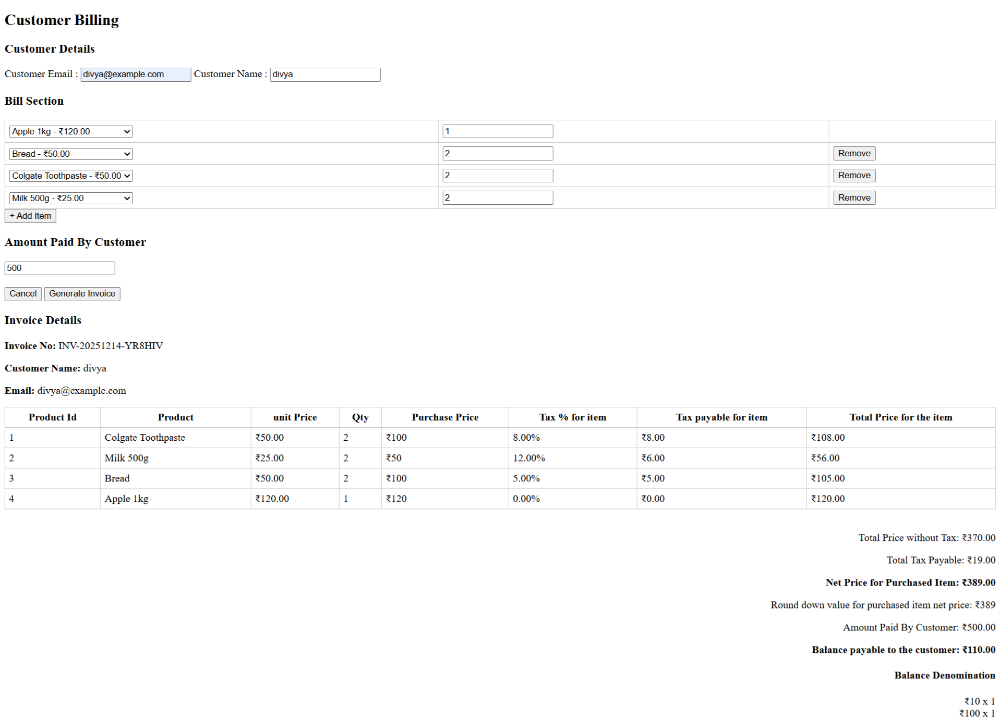
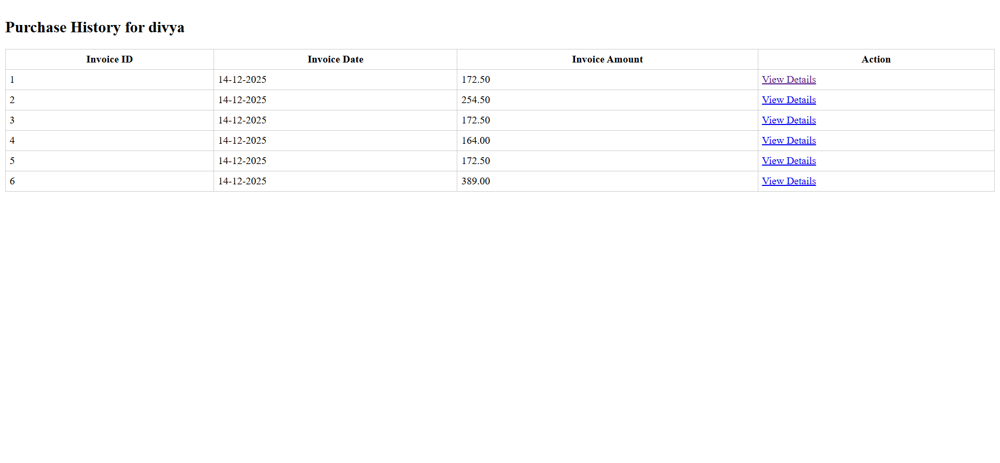
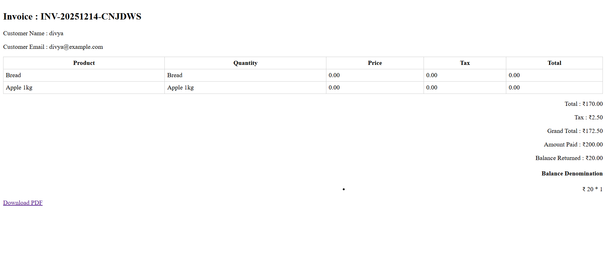

Customer Billing & Purchase Tracking System

Project Overview

This project is a Customer Billing & Purchase Tracking System built using Laravel 12 and MySQL.
It allows a store to generate customer bills, manage product stock, calculate taxes, return balance using available denominations, and provide business insights for analytics and marketing purposes.

The implementation strictly follows the Mini Task requirements shared for the Laravel Developer interview.

Tech Stack

Backend: Laravel 12 (PHP 8.3)

Database: MySQL

Frontend: Blade + Vanilla JavaScript (AJAX)

PDF Generation: barryvdh/laravel-dompdf

Mail: Laravel Mail (SMTP)

⚙️ Installation & Setup
1) Clone the Repository
git clone <repository-url>
cd billing-purchase-tracking-system

2) Install Dependencies
composer install

3) Environment Setup
copy .env.example .env
php artisan key:generate

Update .env with database credentials:

DB_DATABASE=customer_billing
DB_USERNAME=root
DB_PASSWORD=

4) Run Migrations & Seeders
php artisan migrate --seed

5) Start Server
php artisan serve

Access the application:

http://127.0.0.1:8000/invoice/create

Billing & Invoice Flow
Billing Page – 1

Enter Customer Email & Name

Auto-fill customer name if email already exists

Add multiple products with quantity

Enter amount paid by customer

First product row has Add More

Additional rows have Remove option

On Generate Invoice

Calculates:

Subtotal (without tax)

Item-wise tax

Total tax

Net price

Calculates balance payable

Breaks balance using available denominations

Displays invoice details on Billing Page – 2

Sends PDF invoice to customer email

📄 Billing Page – 2 (Invoice View)

Displays:

Product-wise breakdown:

Product ID

Product Name

Price

Quantity

Purchase Price

Tax %

Tax payable per item

Total price per item

Summary:

Total Price without Tax

Total Tax Payable

Net Price

Rounded-down value

Amount Paid

Balance Payable

Denomination breakdown

Business Insight APIs
Case 1: High-Variety Customers

Customers who purchased 5 or more distinct products in a single day

Returns top 5 customers with:

Total amount spent

Total tax paid

Total items purchased

Case 2: Stock Forecast

Average daily sales for last 7 days

Estimated days until stock runs out

Case 3: Repeat Customer Insights

Customers who made a second purchase within 7 days

Shows first & second purchase date

Total spending

Returns last 5 customers

Case 4: High-Demand Orders

Invoices that include top 5 most sold products in last 30 days

Key Routes

/invoice\create          → Generate Billing

/products                → Product list API

/customer/by-email       → Customer auto-fill API

/invoice (POST)          → Generate invoice

/api/insights/*          → Business insight APIs
api/insights/high-variety
api/insights/stock-forecast
api/insights/repeat-customers
api/insights/high-demand-orders

Data Integrity & Best Practices

Database transactions used for:

Invoice creation

Stock update

Denomination handling

lockForUpdate() used to prevent race conditions

Service layer used for business logic

Clean separation of concerns (Controller → Service → Model)

Screenshots for Submission

Billing Page – 1 (Empty & Filled)

Billing Page – 2 (Generated Invoice)

Database tables (Invoices, Invoice Items)

Sample business insight API responses!

